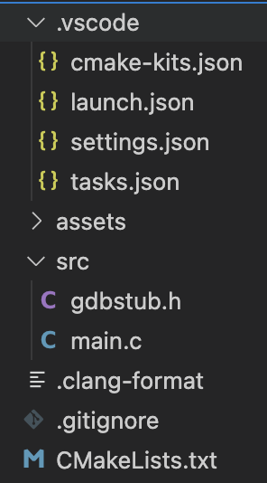
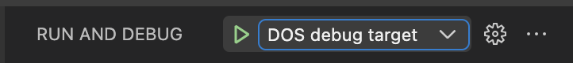
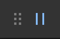
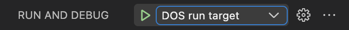
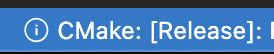
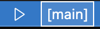

# VS Code DOS Development Extension (dos-dev)


The VS Code DOS development extension is a plug-and-play solution for writing and debugging 32-bit protected mode DOS appliations in C/C++.

## Features
* Automatic installation of required tools
    * [DJGPP](https://www.delorie.com/djgpp/), a fork of GCC 12.1.0, to compile C/C++ 32-bit protected mode DOS applications
    * A [GDB fork](https://github.com/badlogic/gdb-7.1a-djgpp/releases/tag/gdb-7.1a-djgpp) for debugging
    * A [DOSBox-x fork](https://github.com/badlogic/dosbox-x/) with modifications to support remote debugging via GDB
    * [Ninja](https://ninja-build.org/)
    * Extensions for C/C++ development in VS Code
        * [C/C++ Extension Pack](https://marketplace.visualstudio.com/items?itemName=ms-vscode.cpptools-extension-pack)
        * [CMake Tools](https://marketplace.visualstudio.com/items?itemName=ms-vscode.cmake-tools)
        * [clangd](https://marketplace.visualstudio.com/items?itemName=llvm-vs-code-extensions.vscode-clangd)
        * [Native Debug](https://marketplace.visualstudio.com/items?itemName=webfreak.debug)
    * A DOSBox-x configuration for debugging
    * A CMake toolchain file for DJGPP
* Simple project initialization
    * CMake based builds, both in VS Code and on the command line
    * VS Code launch configurations for debugging
    * Sane default settings for C/C++ development
    * [GDB stub](https://sourceware.org/gdb/onlinedocs/gdb/Remote-Stub.html) integration for debugging
    * A simple mode 0x13 demo app plotting pixels while waiting for a keypress
    * Sensible .gitignore
* Debugging support in VS Code and the command line via GDB

## Quickstart
* Install CMake
    * On Linux, install these packages through your package manager

        `libncurses5 libfl-dev libslirp-dev libfluidsynth-dev`
* Install the extension in VS Code
    * `CTRL+SHIFT+P` (or `CMD+SHIFT+P` on macOS)
    * `ext install badlogicgames.dos-dev`
* Open a new empty folder, then
    * `CTRL+SHIFT+P` (or `CMD+SHIFT+P` on macOS)
    * `DOS: Init Project`
        * When asked to install the DOS tools, select `Yes`
        * When asked to install clangd, select `Yes`
    * Press `F5` to build and debug the demo app in DOSBox-x.

## Requirements
You need to install the following 3rd party software:
* [CMake](https://cmake.org/). Ensure it's available on the command line via your `PATH` environment variable.
    * Windows: use the installer from the [CMake download page](https://cmake.org/download/).
    * Linux: use your package manager, e.g. `sudo apt install cmake`
    * macOS: use [Homebrew](https://brew.sh/), `brew install cmake`
* On Linux, install `libncurses5 libfl-dev libslirp-dev libfluidsynth-dev` via your package manager.
    * Ubuntu/Debian: `sudo apt install libncurses5 libfl-dev libslirp-dev libfluidsynth-dev`

Everything else is taken care of by the automatic tools installation.

## Usage

### Installing the tools
* `CTRL+SHIFT+P` (or `CMD+SHIFT+P` on macOS)
* Type and select `DOS: Install tools`

This will download DJGPP, GDB, DOSBox-x, Ninja, a DOSBox-x configuration file for debugging, and a CMake toolchain file for DJGPP to the folder `$HOME/.dos`.

You only need to install the tools once. They can then be used by all your DOS projects.

### Initializing a new project
* Open a new empty folder in VS Code
* `CTRL+SHIFT+P` (or `CMD+SHIFT+P` on macOS)
* Type and select `DOS: Init project`

The first time you run this command in VS Code, you will be asked if you want to install the development tools if they are not yet installed.

You may also be asked to pick a "Kit". Select `djgpp` from the list.

You may be asked to install `clangd`. Select `Yes`.

Finally, you may be asked if you want to "Configure" the project. Select `Yes`.

The command will generate a project looking like this:



In the root of the project, you find
* `.clang-format`, a format definition used to format your `.h`, `.c`, or `.cpp` files. Th `.vscode/settings.json` file configures formatting on save.
* `.gitignore`, to exclude folders that should not get commited to your Git repository.
* `CMakeLists.txt`, the CMake build definition.

The `src/` folder contains the sources of your app. By default, 2 files are added:
* `gdbstub.h`, a [GDB stub](https://sourceware.org/gdb/onlinedocs/gdb/Remote-Stub.html) implementation as a head-only library file you can include in your app to support debugging.
* `main.c`, a simple demo app that sets mode 0x13, draws random pixels, and waits for a key press to exit.

The CMake build will automatically pick up any new source files in the `src/` folder or sub-folders of `src/`.

The `assets/` folder is where you play your asset files, e.g. graphics, sounds, etc. The CMake build will copy these next to your app's executable. Note that in general, DOS only supports [8.3 file names](https://learn.microsoft.com/en-us/openspecs/windows_protocols/ms-fscc/18e63b13-ba43-4f5f-a5b7-11e871b71f14). Some DOS enviroments, e.g. DOSBox-x do support long file names. To provide maximum compatibility, stick to the 8.3 file name format for your assets and executable files.

The `.vscode/` folder contains various configuration files, defining launch configurations, sensible settings for C/C++ development, and so on. In general, you do not have to touch them.

### Debugging and running
The project template provides two launch configurations:

* `DOS debug target`
* `DOS run target`

To debug your app, select the `DOS debug target` configuration in the `Run and Debug` panel.



Also make sure you have the CMake `Debug` variant selected, which you can accomplish via the status bar at the bottom of VS Code.


Press `F5` to start debugging. The debugger will stop at the statement after the call to `gdb_start()`. You can set breakpoints, step, continue, and inspect local variables as usual.

If your app is running, you can interrupt it at any point using the `Pause` button of the debugger controls.



The debugger will stop at the statement after the call to `gdb_checkpoint()`.

> **Note**: you can not set breakpoints while the app is running.

If you want to run the app without a debugger attached, select the `DOS run target` launch configuration in the `Run and Debug` panel.



Also make sure you have the CMake `Release` variant selected, which you can accomplish via the status bar at the bottom of VS Code.



Press `F5` to start run your app without a debugger attached.

Both launch configurations will launch the currently selected CMake launch target. If you have added additional executable targets in the `CMakeLists.txt` file, make sure to select the one you want to launch via the CMake launch target setting in the status bar.



By default, there is only one executable target called `main` which is automatically selected as the CMake launch target.

> **Note:** If the launch configuration and CMake variant do not match, e.g. `DOS debug target` and `Release` variant, or `DOS run target` and `Debug` variant, the debugger is not able to connect, or the app will hang.

## Building and running on the command line
The below assume you are running in a `Bash` like environment, e.g. any shell on macOS or Linux, for Git Bash on Windows.

You can also run the below on Windows in `cmd.exe` or Powershell. However, you need to adjust any paths starting with `~/.dos` to point to the respective directory in your user's home directory.

All commands are meant to be executed in the root folder of the project.

### Building
```
cmake -DCMAKE_BUILD_TYPE=Debug -DCMAKE_MAKE_PROGRAM=~/.dos/ninja -DCMAKE_TOOLCHAIN_FILE=~/.dos/toolchain-djgpp.cmake -S . -B build -G Ninja
```

This configures your build to produce a debug binary. For a release binary, specify `-DCMAKE_BUILD_TYPE=Release`. You generally run this command only when your build type changes or you've made changes to your `CMakeLists.txt` file.

Once configured, you can build the program as follows:
```
cmake --build build
```
You run this everytime you added, removed, or modified source code or assets.

This puts the executable file and assets in the `build/` directory.

### Running
```
~/.dos/dosbox-x/dosbox-x -fastlaunch -exit -conf tools/dosbox-x.conf build/main.exe
```

Launches the executable in DOSBox-x. Make sure to configure and build with `-DCMAKE_BUILD_TYPE=Release` before launching.

### Debugging
```
~/.dos/dosbox-x/dosbox-x -fastlaunch -exit -conf tools/dosbox-x.conf build/main.exe
```

Launches the executable in DOSBox-x. Make sure to build with `-DCMAKE_BUILD_TYPE=Debug` before launching.

In a second shell:

```
~/.dos/gdb/gdb
(gdb) file build/main.exe
(gdb) target remote localhost:5123
```

GDB will connect to the program running in DOSBox-x. See the [GDB cheat sheet](https://darkdust.net/files/GDB%20Cheat%20Sheet.pdf) on how to use the command line driver of GDB.


## Adding debugging support to your application
By default, the `main.c` source file is setup to support debugging, so you do not have to do the below manually.

If you start from a clean slate and want to add debugging support to your application, you'll have to integrate the [GDB stub](https://sourceware.org/gdb/onlinedocs/gdb/Remote-Stub.html).

Debugging is accomplished via the [GDB stub](https://sourceware.org/gdb/onlinedocs/gdb/Remote-Stub.html) implemented in `src/gdbstub.h`, a header-only library, which requires cooperation from your application.

In your source file that contains your `main()` function, include the stub as follows:

```
#define GDB_IMPLEMENTATION
#include "gdbstub.h"
```

At the beginning of your `main()` function, call `gdb_start()`:

```
int void main(void) {
    gdb_start();

    // Rest of your code

```

When compiling your app for debugging, `gdb_start()` will wait for the debugger to connect.

Finally, if your app has a main loop, add `gdb_checkpoint()` at the end of the loop:

```
do {
    // Your main loop implementation

    gdb_checkpoint();
} while (some_condition)
```

This will allow the debugger to interrupt your program.

When compiling your app in release mode, `gdb_start()` and `gdb_checkpoint()` are no-ops.

## Known Issues
The debugger has a few limitations & gotchas:

* You can not set breakpoints while the program is running. Set breakpoints before launching a debugging session, or while the program is halted after hitting a breakpoint, stepping, or was interrupted.
* The debugger is quite a bit slower than what you may be used to. This is due to the use of the serial port emulation for communication.
* Always make sure to close the DOSBox-x window before launching a new debugging session.
* If the debugger appears to be stuck, either wait for it to timeout, or execute the `Debug: Stop` command from the command palette.
* In general, the debugging support is one big hack, there may be dragons. Still better than `printf`-ing your way through life!

The tools currently do not work on ARM64 Linux or ARM64 Windows. They do work on Apple Silicon on macOS.


## FAQ

### DOS development resources

Check out the resources below to get your DOS programming juices flowing:

* [256-Color VGA Programming in C](http://www.brackeen.com/vga/index.html), a 5 part tutorial on VGA programming, using DJGPP.
* [The Art of Demomaking](https://www.flipcode.com/archives/The_Art_of_Demomaking-Issue_01_Prologue.shtml), a 16 part series explaining and demonstrating various demo effects, using DJGPP.
* [Brennan's Guide to Inline Assembly](http://www.delorie.com/djgpp/doc/brennan/brennan_att_inline_djgpp.html), in case you want to speed up your app with some artisan, hand-crafted assembly.
* [My MiniFB DOS backend](https://github.com/emoon/minifb/pull/98), which makes it easy to handle keyboard and mouse input, get a high-precision timer, and set VESA modes. See [`dos.c`](https://github.com/emoon/minifb/blob/2ff844e981c00bb2b0c3cc788a6b455a3fc982e3/tests/dos/dos.c) for an example.

### How does the debugging work?
I'm glad you ask! It's an unholy ball of duct tape consisting of:

* [GDB stub](https://sourceware.org/gdb/onlinedocs/gdb/Remote-Stub.html), implemented as a header-file only library in [`src/gdbstub.h`](https://github.com/badlogic/vscode-dos-dev-extension/blob/main/template/src/gdbstub.h). It implements the [GDB remote protocol](https://sourceware.org/gdb/onlinedocs/gdb/Remote-Protocol.html) and is included in the program itself, which it will then control and "expose" to the debugger for inspection and modification. It's a heavily modified and extended version of [Glenn Engel & Jonathan Brogdon GDB stub](http://ftp.lanet.lv/ftp/mirror/x2ftp/msdos/programming/djgpp/v2misc//gdbst01s.zip), so it can actually do all the things expected of a somewhat modern debugger. I would suggest not looking into that file. It was not build with love or care, just enough spite so it gave up and started working. Mostly.
* [A custom, minimal build of GDB 7.1a](https://github.com/badlogic/gdb-7.1a-djgpp), one of the last versions of GDB to support `COFF_GO32` executables as produced by DJGPP.
* [A modified version of DOSBox-x](https://github.com/badlogic/dosbox-x), which was necessary as serial port communication over TCP/IP was broken on macOS. My [pull request](https://github.com/joncampbell123/dosbox-x/pull/3892) was merged, so hopefully this template can switch over to the official DOSBox-x build eventually.

And here's how it works:

1. DOSBox-x is configured to expose serial port 0 (COM1) to the outside world via TCP on port 5123 in nullmodem, non-handshake mode.
1. The program is started in DOSBox-x and first calls `gdb_start()`. This function initializes the serial port to use the highest baud rate possible, then triggers a breakpoint via `int 3`. This in turn triggers a special signal handler implemented in the GDB stub which listens for incoming data from the serial port.
1. The debugger (GDB) is told to connect to a remote process via TCP at address localhost:5123. This establishes a connection to the signal handler that waits for data coming in on the serial port.
1. GDB sends commands, like set a breakpoint, step, or continue, which the signal handler interprets and executes.
1. As a special case, if the program is running and the debugger wants to interrupt it to set further breakpoints or get information, the GDB stub also hooks the timer interrupt to poll the serial port state. In case there's data waiting, it set an internal flag, which will prompt `gdb_checkpoint()` to trigger a software breakpoint via `int 3`, which in turn will invoke the signal handler.

In theory, all of this is very simple. In practice, it can fall apart in the most creative ways. The implementation was tested with the included GDB version, as well as the Native Debugger extension which sits on top the included GDB version.

I can make no guarantees it will work with other GDB versions or higher level debuggers as found in e.g. CLion, etc. It should. But it might not, as most debuggers don't stick to the protocol spec.

## Release Notes

## [1.3.0]
- Improve `DOS debug target` by not showing the Native Debug extensions internal console window.

## [1.2.0]
- Fix `DOS run target` launch config on Windows. Need to run via a `.bat` file in Powershell to get the same behaviour.
- Show `Waiting for debugger` when `gdb_start()` is called in a debug configuration.
- Fix configuring project after project init on Windows.

## [1.1.0]
- README.md updates

## [1.0.0]

- Initial release

